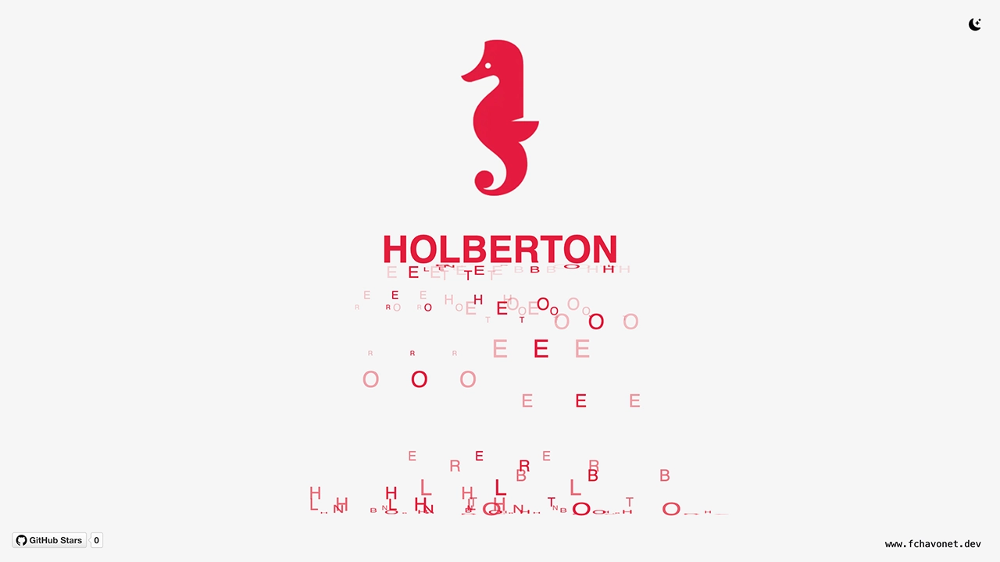

# Holberton Letter Cascade

## Description

This project features a captivating letter cascade animation inspired by an Instagram reel.

The animation showcases the letters of the word "HOLBERTON" falling gracefully to create a visually engaging experience. Built with HTML, CSS, and JavaScript, it demonstrates the potential of web animations while adding a personalized twist to a popular visual effect.

## Objectives

- Replicate a popular visual effect using web technologies.
- Incorporate the school's colors and branding for a personalized touch.
- Deliver an engaging and interactive user experience.
- Enhance skills in CSS animations and JavaScript DOM manipulation.

## Tech Stack


## File Description

| **FILE**     | **DESCRIPTION**                                     |
| :----------: | --------------------------------------------------- |
| `assets`     | Contains the resources required for the repository. |
| `index.html` | Main HTML structure for the project.                |
| `style.css`  | Styles and animations for the project.              |
| `script.js`  | Behavior script for interactivity.                  |
| `README.md`  | The README file you are currently reading 😉.       |

## Installation & Usage

### Installation

1. Clone this repository:
    - Open your preferred Terminal.
    - Navigate to the directory where you want to clone the repository.
    - Run the following command:

```
git clone https://github.com/fchavonet/creative_coding-holberton_letter_cascade.git
```

2. Open the cloned repository.

### Usage

1. Open the `index.html` file in your web browser.

2. Watch the letter cascade animation in action.

You can also test the project online by clicking [here](https://fchavonet.github.io/creative_coding-holberton_letter_cascade/).

> For the best experience, it's recommended to use Google Chrome.

<p align="center">
    <picture>
        <source media="(prefers-color-scheme: dark)" srcset="./assets/images/screenshots/desktop_page_screenshot-dark.webp">
        <source media="(prefers-color-scheme: light)" srcset="./assets/images/screenshots/desktop_page_screenshot-light.webp">
        
    </picture>
</p>

## What's Next?

- Fix the rendering glitch occurring in Firefox and Safari.

## Thanks

- A big thank you to my friends Pierre and Yoann, always available to test and provide feedback on my projects.

## Author(s)

**Fabien CHAVONET**
- GitHub: [@fchavonet](https://github.com/fchavonet)